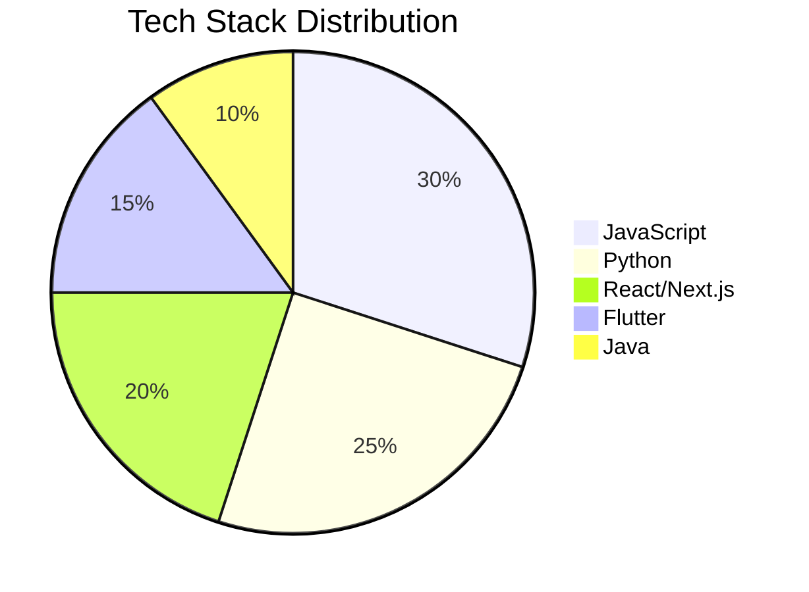

# <div align="center">👨‍💻 VENOM DEVELOPER</div>
<div align="center"></div>

<div align="center">
  
</div>

## <div align="center">💻 Tech Stack 💻</div>

<div align="center">
  <a href="#"></a>
  <a href="#"></a>
  <a href="#"></a>
  <a href="#"></a>
  <a href="#"></a>
  <a href="#"></a>
  <a href="#"></a>
</div>

## 📊 Skills Dashboard



### 📈 Skill Proficiency

<div align="center">

| Skill | Proficiency |
|-------|------------|
| JavaScript | 🟩🟩🟩🟩⬜ 80% |
| Python | 🟩🟩🟩🟩⬜ 80% |
| React.js | 🟩🟩🟩⬜⬜ 60% |
| Next.js | 🟩🟩🟩⬜⬜ 60% |
| Flutter | 🟩🟩🟩⬜⬜ 65% |
| Java | 🟩🟩⬜⬜⬜ 45% |
| Tailwind CSS | 🟩🟩🟩🟩⬜ 75% |

</div>

## 💼 Professional Experience

<div align="center">

</div>

```javascript
const professionalJourney = {
  currentRole: "Remote Junior Engineer",
  company: "Australian-Based Tech Firm",
  focus: ["Full-stack Development", "Mobile Applications", "UI/UX Implementation"],
  achievements: [
    "Contributed to cross-platform mobile applications using Flutter",
    "Implemented responsive designs with Tailwind CSS",
    "Developed features for Next.js applications",
    "Collaborated with international team members across time zones"
  ]
};
```

## 🚀 Projects

<div align="center">
<table>
  <tr>
    <td width="50%">
      <h3 align="center">Project 1</h3>
      <div align="center">
        <a href="#" target="_blank"></a>
        <p>
          <a href="#" target="_blank">
            
          </a>  
          <a href="#" target="_blank">
            
          </a>
        </p>
        <p><strong>Technologies Used:</strong> React, Tailwind CSS, JavaScript</p>
        <p>Project description goes here. This is where you would describe what the project does and your contributions.</p>
      </div>
    </td>
    <td width="50%">
      <h3 align="center">Project 2</h3>
      <div align="center">
        <a href="#" target="_blank"></a>
        <p>
          <a href="#" target="_blank">
            
          </a>  
          <a href="#" target="_blank">
            
          </a>
        </p>
        <p><strong>Technologies Used:</strong> Flutter, Firebase, Dart</p>
        <p>Project description goes here. This is where you would describe what the project does and your contributions.</p>
      </div>
    </td>
  </tr>
</table>
</div>

## 📈 GitHub Statistics

<div align="center">
  
</div>

<div align="center">
  
</div>

## 📫 Connect With Me

<div align="center">
  <a href="https://linkedin.com/in/yourusername"></a>
  <a href="https://twitter.com/yourusername"></a>
  <a href="mailto:your.email@example.com"></a>
  <a href="https://github.com/yourusername"></a>
</div>

---

<div align="center">
  
</div>

<div align="center">
  
</div>
