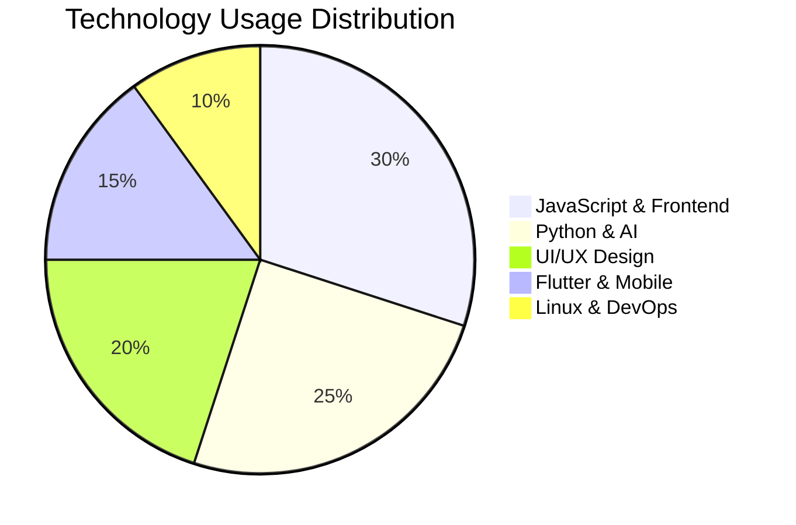

<div align="center">
  
</div>

<div align="center"></div>

<div align="center">
  
</div>

<p align="center">
  <a href="https://github.com/Dhrubo111?tab=followers">
    </a>
  <a href="https://github.com/Dhrubo111?tab=repositories&sort=stargazers">
    </a>
</p>

<details open>
<summary><h2>📊 Skills Ecosystem</h2></summary>

<h3 align="center">🛠️ Core Tech Stack</h3>
<div align="center">
  <a href="#"></a>
  <a href="#"></a>
  <a href="#"></a>
  <a href="#"></a>
  <a href="#"></a>
  <a href="#"></a>
  <a href="#"></a>
</div>

<h3 align="center">🧠 AI & Advanced Technologies</h3>
<div align="center">
  <a href="#"></a>
  <a href="#"></a>
  <a href="#"></a>
  <a href="#"></a>
  <a href="#"></a>
</div>

<h3 align="center">🖌️ UI/UX Design Tools</h3>
<div align="center">
  <a href="#"></a>
  <a href="#"></a>
  <a href="#"></a>
  <a href="#"></a>
  <a href="#"></a>
</div>

<h3 align="center">🐧 Linux Expertise</h3>
<div align="center">
  <a href="#"></a>
  <a href="#"></a>
  <a href="#"></a>
  <a href="#"></a>
</div>

<h3 align="center">📊 Project Management</h3>
<div align="center">
  <a href="#"></a>
  <a href="#"></a>
  <a href="#"></a>
  <a href="#"></a>
</div>
</details>

<details>
<summary><h2>📈 Skill Distribution & Proficiency</h2></summary>

<div align="center">
<h3>🥧 Tech Stack Distribution</h3>



<h3>📊 Skill Proficiency Matrix</h3>

| Skill Category | Technologies | Expertise Level |
|---------------|--------------|-----------------|
| **Frontend** | JavaScript, React, Next.js, Tailwind CSS | 🟩🟩🟩🟩⬜ 80% |
| **Backend** | Python, Java, Node.js | 🟩🟩🟩🟩⬜ 80% |
| **Mobile** | Flutter, React Native | 🟩🟩🟩⬜⬜ 65% |
| **UI/UX Design** | Figma, Adobe XD, User Research | 🟩🟩🟩🟩⬜ 85% |
| **AI/ML** | TensorFlow, PyTorch, LLMs | 🟩🟩🟩⬜⬜ 70% |
| **Linux** | Arch, Ubuntu, Shell Scripting | 🟩🟩🟩🟩🟩 95% |
| **Project Management** | Agile, Scrum, Jira | 🟩🟩🟩🟩⬜ 75% |

<h3>🏆 Comparative Strength Analysis</h3>


</div>
</details>

<details open>
<summary><h2>💼 Professional Experience & Expertise</h2></summary>

<div align="center">

</div>

<div align="center">
<table>
  <tr>
    <td width="50%">
      <h3>💻 Technical Expertise</h3>
      
```javascript
const professionalJourney = {
  currentRole: "Remote Junior Engineer",
  company: "Australian-Based Tech Firm",
  focus: [
    "Full-stack Development",
    "Mobile Applications", 
    "UI/UX Implementation",
    "AI Integration",
    "Linux System Administration"
  ],
  achievements: [
    "Contributed to cross-platform mobile apps using Flutter",
    "Implemented responsive designs with Tailwind CSS",
    "Developed features for Next.js applications",
    "Integrated OpenAI and LangChain solutions",
    "Optimized Linux servers for production deployments"
  ]
};
```
    </td>
    <td width="50%">
      <h3>🎨 Design & Research Experience</h3>
      
```javascript
const designResearchExpertise = {
  methodologies: [
    "User-Centered Design",
    "Design Thinking",
    "Heuristic Evaluation",
    "A/B Testing"
  ],
  tools: [
    "Figma", "Adobe XD", "Sketch",
    "InVision", "Balsamiq"
  ],
  delivered: [
    "User personas & journey maps",
    "Interactive prototypes",
    "UX research studies",
    "Accessibility-focused designs",
    "Design systems implementation"
  ]
};
```
    </td>
  </tr>
</table>
</div>

<div align="center">
<h3>🧠 AI Knowledge & Experience</h3>


```python
# My AI Journey & Expertise
ai_experience = {
    "areas": [
        "Large Language Models", "Generative AI", "Computer Vision",
        "AI Ethics", "Prompt Engineering", "Fine-tuning"
    ],
    "frameworks": ["TensorFlow", "PyTorch", "Hugging Face", "LangChain"],
    "applications": [
        "Developed custom RAG systems for enterprise documentation",
        "Created AI-powered content generation workflows",
        "Implemented computer vision solutions for mobile apps",
        "Designed conversational AI interfaces with enhanced UX"
    ],
    "keeping_updated": [
        "Research paper reviews", "Industry conferences",
        "Open source contributions", "Continuous experimentation"
    ]
}
```
</div>

<div align="center">
<h3>🐧 Linux Expertise</h3>


```bash
# Linux administration experience
linux_skills=(
  "System hardening & security"
  "Shell scripting automation"
  "Server optimization"
  "Docker & containerization"
  "Network configuration"
  "Package management"
  "Custom kernel compilation"
)

# Preferred work environment
setup() {
  window_manager="i3wm"
  terminal="Alacritty" 
  editor="Neovim"
  shell="Zsh with Oh-My-Zsh"
  tools=("tmux" "ranger" "fzf" "ripgrep")
  
  echo "Efficiency through powerful tools & keyboard-driven workflow"
}
```
</div>
</details>


## 📈 GitHub Statistics

<div align="center">
  <a href="https://github.com/anuraghazra/github-readme-stats">
    
    
  </a>
</div>

<div align="center">
  
</div>

<div align="center">
  
</div>

## 📫 Connect With Me

<div align="center">
  <a href="https://linkedin.com/in/yourusername"></a>
  <a href="https://twitter.com/yourusername"></a>
  <a href="https://medium.com/@yourusername"></a>
  <a href="mailto:your.email@example.com"></a>
  <a href="https://github.com/yourusername"></a>
  <a href="https://dribbble.com/yourusername"></a>
</div>

---

<div align="center">
  
</div>

<div align="center">
  
</div>

<div align="center">
  
</div>
